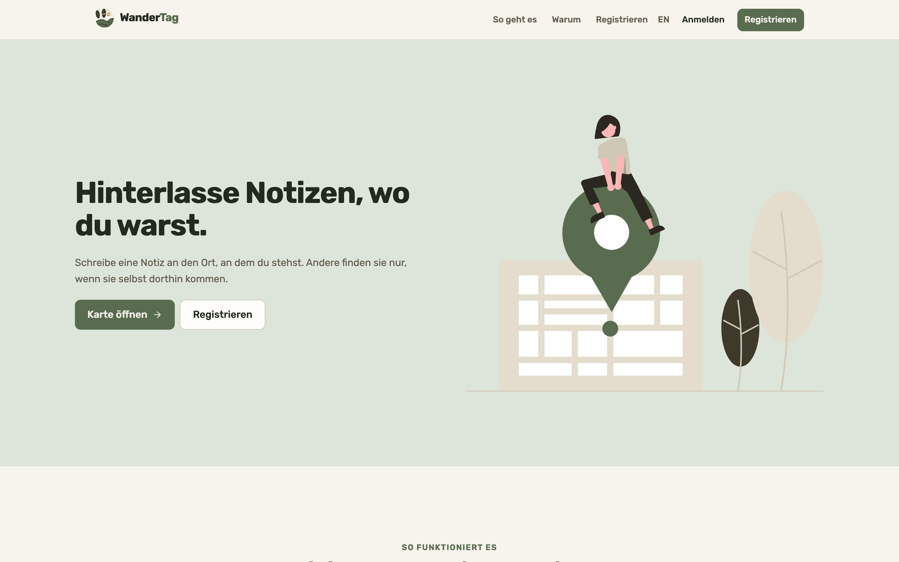
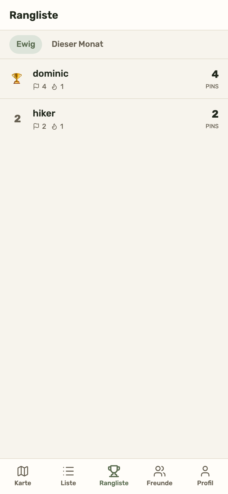
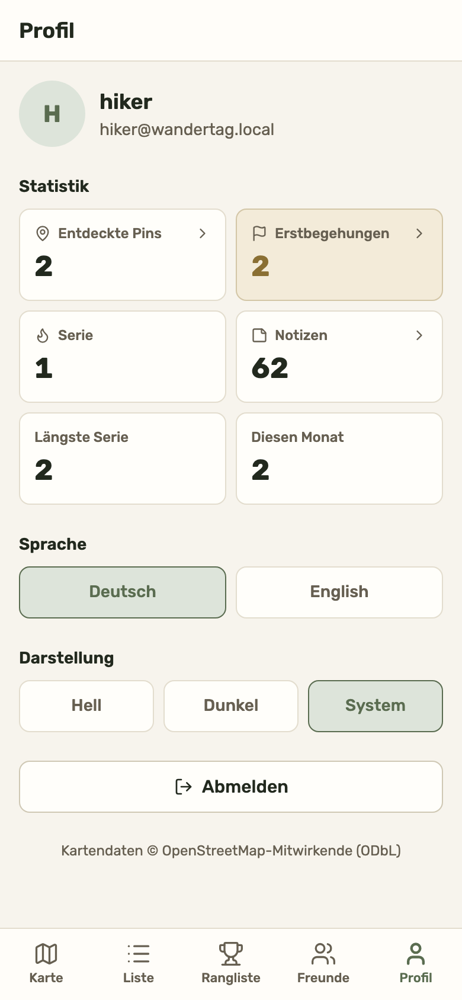
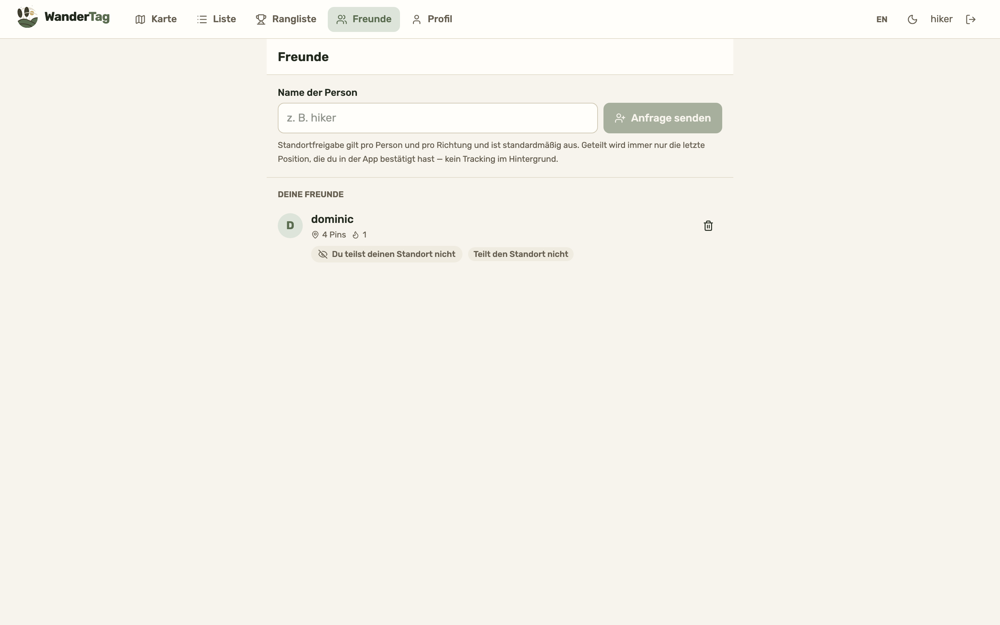
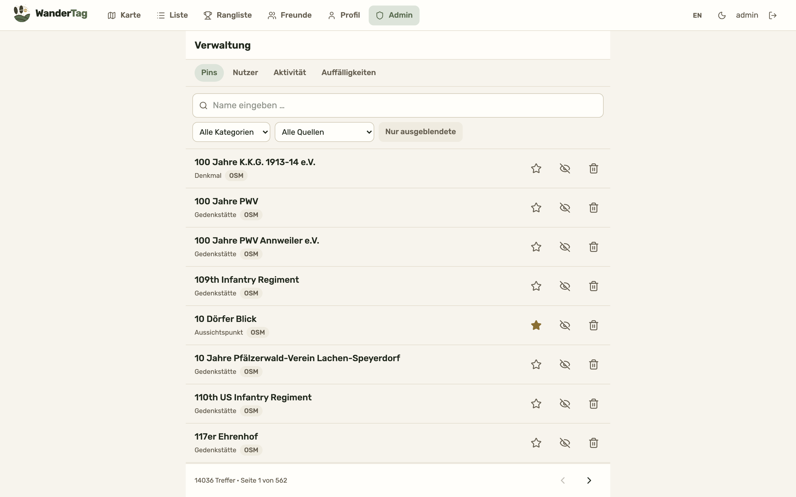
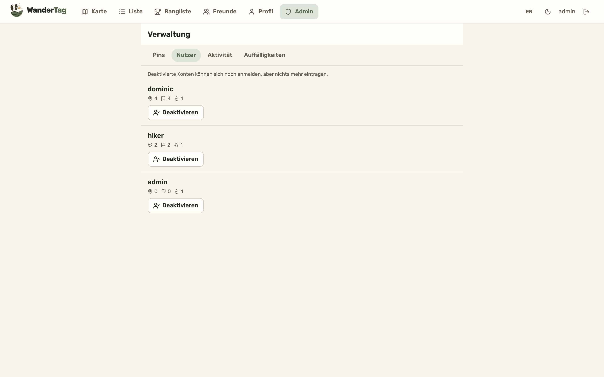

<div align="center">


# WanderTag

**Drop a note where you are standing. Others find it only by going there themselves.**

Mobile-first PWA · SvelteKit 2 · Svelte 5 runes · Tailwind 4 · MapLibre GL ·
TanStack Svelte Query · Keycloak OIDC + PKCE



</div>

---

WanderTag is a geo-anchored notebook for the outdoors. Around 14 000 points of
interest are seeded from OpenStreetMap across Saarland and Rheinland-Pfalz, so the
map is never empty; you uncover a pin by physically standing within 50 m of it, and
what people wrote there unlocks only when you arrive.

Successor to the [dropnote](../../dropnote) prototype, whose brand and palette
this reuses. That prototype was itself called WanderTag; this rebuild takes the
name back, and refers to the original as **dropnote** (its directory) throughout,
so the two are never confused. The API lives in
[`wandertag-backend`](../wandertag-backend) — see its
[API reference](../wandertag-backend/docs/API.md).

---

## The app in pictures

Every shot below comes from a real signed-in session against the live stack —
`npm run screenshots` regenerates them, so they cannot drift from the UI. Screens
that would expose the tester's real position are described rather than shown; see
the note below.

### The map, and the two radii it visualises

> Map, list and pin screenshots are deliberately **not** included. Every one of them
> is taken from a real signed-in session, which means real coordinates: the basemap
> names the streets around the tester, the position dot sits on them, and the nearby
> list gives named landmarks with exact distances — enough to trilaterate a home
> address to within metres. A screenshot of this app is location data.
>
> Run the app locally to see these screens, or capture your own with
> `npm run screenshots`, which centres on a public landmark rather than wherever you
> happen to be.

The map carries the whole mechanic. Hollow tan rings are places **nobody has reached
yet**; teal is people — your own position, and places that exist because somebody
left a note there. Sage is a place already claimed. A legend is one tap away, because
a map whose symbols need explaining is a map nobody trusts.

Distance decides what you get. A pin outside the interaction radius still shows its
name, its distance and a directions link, and says _Zu weit weg — der Inhalt wird
sichtbar, wenn du dort bist_; the notes on it stay unread until you arrive. The one
exception is your own writing, which is always readable from anywhere, so a bad note
can be moderated without a hike.

### Gamification, kept light

<table>
<tr>
<td width="50%"></td>
<td width="50%"></td>
</tr>
<tr>
<td align="center"><em>Global and monthly boards — a newcomer can top the monthly one in a weekend</em></td>
<td align="center"><em>Every stat tile is a button into the searchable, paged list behind that number</em></td>
</tr>
</table>

Four mechanics, no more: pins uncovered, **first blood** on a pin nobody had
reached, a daily streak, and the two leaderboards.

### Friends, with sharing off by default

<div align="center">

</div>

Friendship and location sharing are separate decisions. Sharing is per friend, per
direction, off until you turn it on, and the privacy note sits on the screen rather
than buried in settings.

### Moderation

<table>
<tr>
<td width="50%"></td>
<td width="50%"></td>
</tr>
<tr>
<td align="center"><em>14 036 pins, searchable and filterable server-side; a row opens the pin itself</em></td>
<td align="center"><em>Per-user stats, plus the violation count inside the current anti-cheat window</em></td>
</tr>
</table>

---

## Quick start

The backend owns the infrastructure, so start it first:

```bash
cd ../wandertag-backend && make local-setup && make run   # PostGIS, Keycloak, API
cd ../wandertag-frontend
cp .env.example .env
npm install
npm run dev            # http://localhost:5173
```

Seeded users: `admin` / `admin` (admin + user), `hiker` / `hiker` (user).

| Script                | Purpose                                        |
| --------------------- | ---------------------------------------------- |
| `npm run dev`         | dev server on :5173                            |
| `npm run build`       | production build (+ service worker)            |
| `npm run check`       | `svelte-check` type checking                   |
| `npm run lint`        | Prettier + ESLint                              |
| `npm run test:unit`   | Vitest (25 tests)                              |
| `npm run test:e2e`    | Playwright against the real stack (30 tests)   |
| `npm run screenshots` | regenerate `docs/screenshots/` for this README |

`npm run screenshots` needs the full stack running, exactly like the e2e suite. It
uses a separate Playwright config (`playwright.screenshots.config.ts`) rather than
living in the test suite: a failure there means "the picture did not come out", not
"the app is broken", and `npm run test:e2e` should stay a signal about behaviour.

---

## Mobile-first, not mobile-also

The app is used outdoors, one-handed, on a phone. That drives the whole layout:

- **Bottom tab bar**, never a top nav — the top of a phone screen is the least
  reachable part of it.
- **Bottom sheets** for pin and note detail, with swipe-to-dismiss, so the map
  stays visible above and the user keeps their spatial context.
- The drop-a-note **FAB** sits bottom-right, clear of the tab bar.
- `100dvh` and `env(safe-area-inset-*)` throughout: `100vh` leaves a dead strip
  when the mobile URL bar collapses, and the tab bar must clear the home indicator.
- Every tappable target is at least 44 px (`.touch-target`).

## Structure

Mirrors the conventions of
[`baik-crm-frontend`](../../baik/baik-crm-frontend).

```
src/
├── api/                    one folder per domain
│   ├── api.ts              axios client + Keycloak bearer interceptor
│   ├── errors.ts           maps the backend's error codes
│   └── {config,pins,notes,me,friends,admin,leaderboard}/
│       └── {types,service,queries}.ts   TanStack query-key factories
├── hooks/
│   ├── use-auth.svelte.ts        Keycloak PKCE, rune-backed
│   ├── use-roles.svelte.ts       realm roles → isAdmin
│   ├── use-geolocation.svelte.ts the single source of "where am I"
│   └── use-theme.svelte.ts
├── lib/
│   ├── components/{map,pins,notes,landing,friends,admin,gamification,ui}/
│   ├── i18n/{de,en}.ts           typed message catalogues
│   └── utils/
└── routes/
    ├── +page.svelte              public landing page
    ├── layout.css                brand tokens (light + dark)
    └── (app)/{map,list,board,friends,profile,admin}/

e2e/                        Playwright behaviour suite
screenshots/                Playwright capture script for this README
docs/screenshots/           the resulting PNGs
```

`(app)` is the shell with the tab bar. Map, list and board are browsable
anonymously; profile requires a session and admin requires the role. Those gates
are **cosmetic** — every admin action is re-checked by `@PreAuthorize` on the
server, because a token parsed in the browser is only ever a hint.

### Geolocation

`use-geolocation.svelte.ts` wraps a single `watchPosition` started once by the
`(app)` layout. One permission prompt, one GPS consumer, and the position survives
tab navigation. Every geo-gated action reads from it, so there is exactly one place
a position enters the app.

### Radius

Nothing in the UI hardcodes a distance. `useConfig()` reads `GET /api/v1/config`,
so raising `GEO_REVEAL_RADIUS_M` on the server changes both the app's behaviour and
its copy — including the landing page — with no frontend release. The map also
derives a `radiusM` from the visible viewport, which makes zooming out the radius
control for rural areas; the server clamps it.

### A note always belongs to a pin

Dropping a note where no place exists **creates** the place, and everyone who
arrives later adds their notes to that same pin. There is no such thing as a
free-standing note.

That is why the map has no separate note marker: a `USER` pin _is_ the note's
marker, drawn in the people colours. The earlier model with both produced two
markers stacked on one spot, and a Notes tab that listed things the Places tab did
not.

### Map

MapLibre GL over an [OpenFreeMap](https://openfreemap.org) vector basemap
(`PUBLIC_MAP_STYLE_URL` is server-configured, so swapping to MapTiler or a
self-hosted Protomaps `.pmtiles` is a one-line change).

The marker vocabulary splits along one line — **sage and tan are places, teal is
people**:

| Marker              | Meaning                                            |
| ------------------- | -------------------------------------------------- |
| filled sage         | you have uncovered this pin                        |
| pale sage           | someone has, you have not                          |
| **hollow tan**      | nobody has been here — first blood is open         |
| tan outer ring      | curated: placed by an admin, not imported          |
| **teal**            | a place a person created by leaving a note there   |
| dark teal dot       | you                                                |
| pale teal, labelled | a friend who shares their position, faded with age |

Dimmed markers are outside the interaction radius. The interaction radius itself is
drawn as a real circle on the ground, so the rule is visible rather than something
the user infers from error messages.

Two things to know if you touch the map:

- `maplibre-gl.css` forces `position: relative` on `.maplibregl-map`, which makes
  `absolute inset-0` inert and collapses the container to 0 px. Size it with
  `h-full w-full`, and keep `min-h-0` on every flex ancestor.
- GeoJSON coordinates are `[lon, lat]`. `markers.test.ts` guards this.

## Theme

**Sage, linen and tan** — four anchor colours, all from one natural family:

| Token family | Anchor                | Role                                                       |
| ------------ | --------------------- | ---------------------------------------------------------- |
| sage         | `#8FA28A` / `#C7D3C0` | the brand hue; primary, accents, subtle fills              |
| linen        | `#F7F4ED`             | the light ground, and the text colour in dark mode         |
| tan          | `#C8A96B`             | the one warm accent — first blood and rank 1, nothing else |

Two rules worth keeping when editing `src/routes/layout.css`:

- **Pick by contrast, not by hex.** The anchor sage and tan are ~2:1 on a linen
  ground, so the _roles_ (`--primary`, `--rare`) reach for darker steps of the same
  hues and keep the anchors for fills and strokes.
- **No neutral greys.** Every "grey" is a warm linen or a desaturated sage. That is
  what makes the whole thing read as outdoors rather than as a dashboard.

Dark mode keeps the same three families and swaps their roles: linen becomes the
text, near-black linen the ground, and the sage/tan roles move to lighter steps.
The basemap has no dark variant on this tile host, so it gets a mild
`brightness(0.82)` trim in dark mode — dimmed, never inverted, which would wreck
legibility.

`MARKER_COLORS` in `src/lib/components/map/markers.ts` duplicates these as hex
literals, because MapLibre paint expressions cannot read CSS custom properties.
Keep the two in step.

Typography is **Rubik**, as in dropnote. The illustrations and logo were recoloured
out of dropnote's emerald-and-navy scheme into these families; the originals are
kept in `static-src/` so the recolouring is revertible.

## Responsive layout

One breakpoint carries the weight: **`md` (768px)**. Above it the app is not a
stretched phone, it is a different arrangement — the same split dropnote used.

|                        | mobile (`< md`)                             | desktop (`≥ md`)                                           |
| ---------------------- | ------------------------------------------- | ---------------------------------------------------------- |
| Navigation             | `BottomNav` — fixed tab bar under the thumb | `TopNav` — header bar with logo, sections, user controls   |
| Map page               | full-bleed map, FAB to drop a note          | nearest-first `aside` sidebar + map, button in the sidebar |
| Detail panel           | `Sheet` as a bottom sheet, swipe to dismiss | `Sheet` as a right-hand side panel                         |
| List / board / profile | full-bleed                                  | centred, max-width column; profile stats go 2 → 3 columns  |

Both navigations are always in the DOM and only one is ever visible, which the e2e
suite asserts in both projects. `--bottom-nav-height` collapses to `0px` at `md`, so
the map's controls stop reserving space for a bar that is not there.

Playwright runs the whole suite twice, `mobile-chrome` and `desktop-chrome`, because
these are genuinely different components rather than a reflow.

## Landing page

`src/routes/+page.svelte` follows dropnote's structure, in
`src/lib/components/landing/`: hero (text + illustration), "how it works" with
alternating numbered rows, a reasons section, then sign-up.

dropnote's pricing tiers are deliberately **not** reproduced — WanderTag has no
billing, and advertising a €5 plan would promise something the app cannot deliver.
`Features.svelte` states the three real mechanics instead, with its distances read
from `GET /api/v1/config` rather than written into the copy.

The sign-up form collects an email and hands off to Keycloak's registration page
with it prefilled (`loginHint`). Account creation stays entirely in Keycloak: doing
it ourselves via the Admin API would mean duplicating password policy, email
verification and duplicate handling, and would bypass the flows that make Keycloak
the identity authority in the first place.

`static/silent-check-sso.html` matters more than it looks — without it, keycloak-js
`check-sso` redirects the _whole page_ to Keycloak on every anonymous visit and
returns with `#error=login_required`, which is a visible flash on the entry page and
cost the e2e suite ~80 seconds of redirects.

## Navigation

WanderTag does not navigate; it hands off. `src/lib/utils/navigation.ts` builds a
walking-directions link per platform — a `geo:` URI on Android so the system chooser
offers OsmAnd or Organic Maps, an Apple Maps universal link with `dirflg=w` on iOS,
Google Maps with `travelmode=walking` elsewhere.

That is a deliberate ceiling, not a shortcut. As a PWA the app cannot keep a route
alive: iOS suspends JavaScript when the screen locks, there is no reliable
background geolocation, and continuous high-accuracy GPS drains the battery. A
dedicated maps app does all of that properly and has better footpath data.

## Friends

`(app)/friends` lists relationships, sends requests by display name, and answers
incoming ones. Location sharing is per friend, per direction, off by default, and
the privacy note sits on the screen rather than in a settings page — it is the one
thing here with real privacy weight.

Friends who share appear on the map in a paler teal than your own dot, labelled, and
**fade with age**: a position older than an hour is dimmed, because these are last
known positions from `/friends/positions`, not live tracking.

## Ratings

`StarRating.svelte` shows 1–5 stars, read-only unless the caller passes `onrate` —
which it only does when the user is signed in and inside the interaction radius. The
filled state shows _your_ score when you have one and the average otherwise, so the
widget answers "what did I give this?" before "what do others think?".

A locked note still shows the aggregate from afar; only rating needs proximity.

## Paging and search

`SearchBar.svelte` debounces (the lists behind it are paged server-side, so typing
"burg" would otherwise fire four queries against 14k rows) and deliberately has **no
value prop** — the input owns its text, and pushing text back in would fight the
debounce mid-keystroke.

`Pager.svelte` is prev/next only: with 562 pages of pins a numbered row is
decoration, and the way anyone actually finds a pin is the search box above it.

Queries use `placeholderData: (previous) => previous` so paging keeps the current
page visible instead of flashing an empty table.

## Profile drill-downs

The stat tiles are buttons. Discovered pins, first ascents and notes each open
`HistorySheet.svelte` — the searchable, paged list behind that number, so a stat is
something you can check rather than something you have to trust. `StatTile` renders
a real `<button>` rather than a div with `role="button"`, which gets keyboard and
focus behaviour for free.

## Admin

`(app)/admin` has four tabs: pins, users, activity and anomalies.

- **Pins** pages over the whole dataset with server-side search and filters by
  category, source and hidden state. A row opens the pin's own sheet, because
  moderating a pin means reading what is on it — and an admin gets every note back
  regardless of distance, which is what makes this usable from a desk.
- **Users** shows per-person stats plus the violation count inside the current
  anti-cheat window, and lets an admin deactivate an account or lift an automatic
  block.
- **Activity** is the cross-user discovery feed.
- **Anomalies** lists rejected position claims so a block can be judged rather than
  trusted.

Pin mutations invalidate both the pin cache and the admin cache. They used to
invalidate only the former, so toggling _featured_ or _hidden_ changed the data
while the row kept its old appearance until a reload.

The screen is gated on `roles.isAdmin`, which is **cosmetic** — every endpoint
re-checks with `@PreAuthorize`.

## i18n

German default (German name, DACH-shaped dataset), English available; the browser
preference wins on a first visit and an explicit choice in the profile wins over
both. `src/lib/i18n/de.ts` is the reference catalogue and `en.ts` is typed as
`Messages`, so a missing or misspelled key fails `npm run check`.

This is a plain typed dictionary rather than a compile-step i18n library
(Paraglide, `svelte-i18n`): with two locales, the `Messages` type already provides
the compile-time safety a generated catalogue would, without the extra build step.
Revisit if a third locale or translator handoff appears.

## Testing

- **Vitest** — pure logic: marker state, GeoJSON axis order, viewport→radius
  arithmetic, distance formatting.
- **Playwright** — the real stack, nothing mocked: a genuine Keycloak PKCE
  redirect, geolocation spoofed to the Zugspitze summit, dropping a note, claiming
  a discovery, opening a pin from the admin table, and role gating. The backend
  must be running with pins seeded
  (`make seed-pois-region BBOX="47.40 10.90 47.50 11.05"`).

`e2e/global-setup.ts` clears the anti-cheat ledger before each run. Without it, one
run's spoofed positions make the next run's actions look like teleporting, and the
suite blocks its own test user.

### CI

`.github/workflows/ci.yml` runs on every push to `main` and every pull request:
**lint** (Prettier + ESLint), **types** (`svelte-check`), **unit tests** (Vitest),
then **build**, plus a Trivy filesystem scan that reports rather than blocks.

The build job passes the `PUBLIC_*` variables explicitly. They are the values from
`.env.example` — nothing secret, and nothing contacted during the build — but
SvelteKit inlines them at compile time, so the bundle will not build without them.

**Playwright is deliberately not in CI.** It mocks nothing: it needs PostGIS with
seeded pins, a Keycloak realm import, and the API from the other repository, plus a
real PKCE redirect and a spoofed GPS fix. Standing that up here would mean building
the backend from a second repo and seeding an OSM extract — slow, and failing for
reasons unrelated to a frontend change. So e2e is a local and pre-release gate; CI
covers lint, types, unit tests and the build. Worth revisiting once the backend
publishes a tagged container image, which it now does on a `v*` tag.

## PWA

Manifest, generated icons, and a service worker precaching the app shell.
Map tiles are deliberately **not** precached — a vector basemap is far too large,
and a stale cached tile is worse than a fresh fetch.
